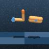
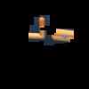

# Branch for StableKeypoint based segmentation on RL

## How to train
first you collect random buffer (here I used 10000 steps) for StableKeypoint pretrain

then you have the trained model, please refer to ```configs/vanilla_visual_config.yaml``` set ```env.use_mask: true``` and add the session ```mask``` 

note that you may need to download pretrained SD model from huggingface and change ```ldm_path``` here

then train RL as usual

## Note
now pieg is not usable

the mask added in env ```wrapper_dmc.py```, which means if you add this module, the observation agent see is a masked observation

<center>
<figure>


</figure>
</center>

the keypoint mask class is named ```Keypoint_HardMask``` in utils, and all the related function are in this file. so if you have the trained ckpt of StableKeypoint, then you dont need that folder

## todo:
- [x] StableKeypoint hard mask
- [ ] integrate pieg
- [ ] textual inversion
- [ ] adaptation